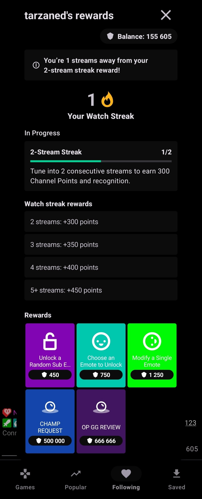
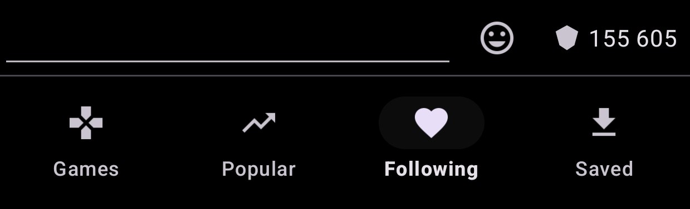

# Xtra for Twitch

  

  A community-maintained fork of <a href="https://github.com/crackededed/Xtra">Xtra</a>, 
  focused on practical fixes and Twitch features that are useful in everyday viewing.

## What this fork adds

Compared with the upstream project, this fork currently includes:

- More reliable live notifications with persisted follow IDs and Helix fallback.
- Channel Points in chat: balances, custom icons, watch streaks, rewards, voting, and redemption.
- Searchable emote pickers limited to emotes belonging to the active channel.
- Fork-hosted releases and update links for existing Xtra installs.

  
  

## Download

You can find released APKs [here](https://github.com/thiscallnet/Xtra/releases/tag/latest).

## License
Xtra is licensed under the [GNU Affero General Public License v3.0](LICENSE).
